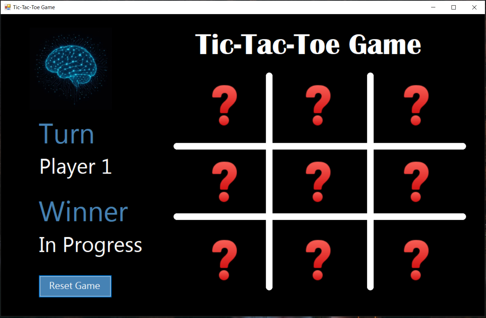
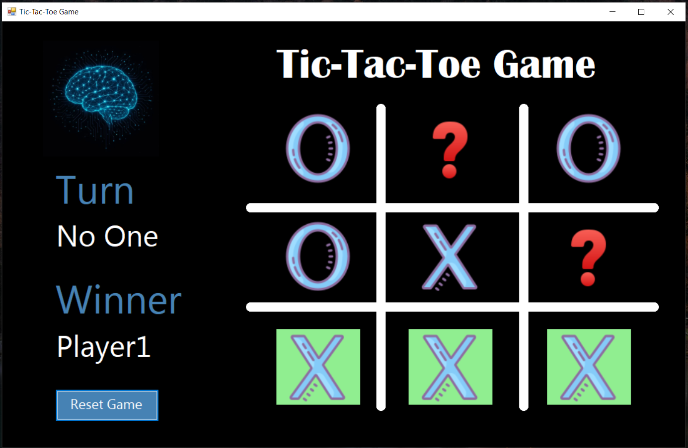
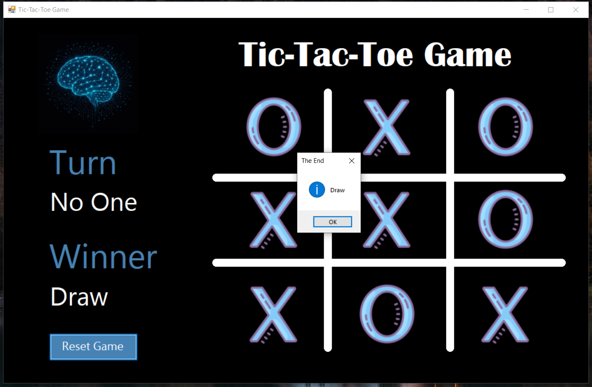

# ❌🅾️ X-O Game (Tic-Tac-Toe)

  

A classic two-player Tic-Tac-Toe game implemented as a **Windows Forms Application** using C#.
This simple project demonstrates fundamental concepts of C# programming,
event handling, and game logic, including checking for winning conditions and managing game state.

---

## 🖼️ Screenshots

**Game Board**  


**Player 1 Wins**  


**Game Draw**  


---

## ✨ Key Features

* **Two-Player Mode:** Play against a friend locally.
* **Dynamic UI:** Visually updates the current player's turn.
* **Winner Detection:** Checks for all winning conditions (rows, columns, diagonals).
* **Draw Detection:** Automatically detects a draw when the board is full.
* **Visual Feedback:** Highlights the winning line in green upon victory.
* **Reset Button:** Allows players to quickly start a new game.

---

## 🕹️ How to Play

### Prerequisites

You need **Visual Studio** (Community Edition or higher) installed on your machine to open and run this project.

### Running the Game

1.  **Clone the repository:**

```bash
    git clone https://github.com/Ibrahim-Abu-Assad/Tic-Tac-Toe-WinForms.git
```

3.  **Open the solution:** Navigate to the cloned folder and open the `X-O-Game.sln` file in Visual Studio.
4.  **Run the project:** Press the **Start** button (often a green triangle icon or F5) in Visual Studio.
5.  **Enjoy!** Player 1 (X) starts first. Click any empty square to place your mark.

### Game Rules
* The first player to get three of their marks in a row (horizontal, vertical, or diagonal) wins.
* If all nine squares are full and no player has three marks in a row, the game is a draw.

---

## 👨‍💻 Author
**Ibrahim Abu-Assad**

🌐 [GitHub Profile](https://github.com/Ibrahim-Abu-Asaad) 
📧 i6802275@gmail.com  

---

## 🎓 Acknowledgements

This project was developed as part of my learning journey in **C# and WinForms**.  
Grateful for the tutorials and guidance of **Dr. Mohammed Abu-Hadhoud**,
available through the **ProgrammingAdvices** platform and YouTube channel,
which provided the resources and examples that made this project possible.

---
